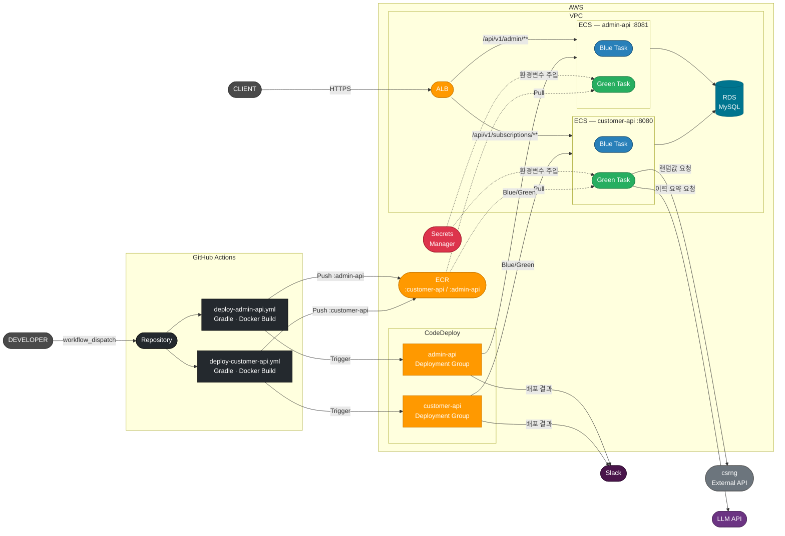
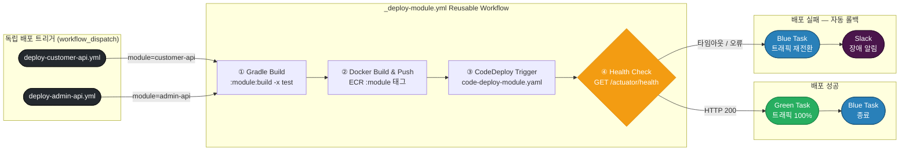

# ARTINUS Backend Engineer (5~8년) 과제

---

## 개요

- 구독 서비스 백엔드 API를 설계하고 구현하는 과제입니다.
- 도메인 설계, API 구현, LLM 연동, 외부 API 장애 대응, 그리고 해당 시스템을 클라우드 환경에 배포/운영하기 위한 아키텍처 설계를 포함합니다.

---

## 도메인 정의

### 구독 상태

- 회원은 아래 3가지 구독 상태 중 1개의 상태만 가질 수 있습니다.

| 상태      | 설명            |
|---------|---------------|
| 구독 안함   | 구독하지 않은 상태    |
| 일반 구독   | 일반 등급 구독 상태   |
| 프리미엄 구독 | 프리미엄 등급 구독 상태 |

### 채널

- 채널이란 구독 및 해지를 수행할 수 있는 창구(접점)를 의미합니다.
- 채널은 아래 3가지 타입으로 구분됩니다.

| 타입          | 구독 | 해지 |
|-------------|----|----|
| 구독/해지 모두 가능 | O  | O  |
| 구독만 가능      | O  | X  |
| 해지만 가능      | X  | O  |

채널 예시

- 구독 서비스의 가입 및 해지는 여러 채널을 통해 이루어질 수 있습니다.

| 채널   | 구독 | 해지 |
|------|----|----|
| 홈페이지 | O  | O  |
| 모바일앱 | O  | O  |
| 네이버  | O  | X  |
| SKT  | O  | X  |
| 콜센터  | X  | O  |
| 이메일  | X  | O  |

### 외부 API (csrng)

- 구독하기 API와 구독 해지 API는 외부 API를 호출하고, 응답 결과에 따라 트랜잭션을 처리합니다.
- 호출 예시
    ```shell
    curl -X GET https://csrng.net/csrng/csrng.php?min=0&max=1
    ```
- 응답 예시
    ```json
    [{ "status": "success", "min": 0, "max": 1, "random": 1 }]
    ```
- `random` 값에 따른 처리

  | random 값 | 처리 |
      |---|---|
  | `1` | 정상 처리 — 트랜잭션 커밋 |
  | `0` | 예외 발생 — 트랜잭션 롤백 |

---

## 요구사항

### 1. 구독하기 API

- 요청: 휴대폰번호, 채널 ID, 변경할 구독 상태
- 입력받은 채널이 구독 가능한 채널인 경우에만 구독할 수 있습니다.
- 최초 회원은 구독 안함, 일반 구독, 프리미엄 구독 중 어떤 상태로든 가입할 수 있습니다.
- 외부 API 호출 후, 응답에 따라 트랜잭션을 커밋 또는 롤백합니다.
- 구독 상태 변경 규칙

  | 현재 상태  | 변경 가능 상태              |
      |--------|-----------------------|
  | 구독 안함  | 일반 구독, 프리미엄 구독        |
  | 일반 구독  | 프리미엄 구독               |
  | 프리미엄 구독 | _(변경 불가)_             |

### 2. 구독 해지 API

- 요청: 휴대폰번호, 채널 ID, 변경할 구독 상태
- 입력받은 채널이 해지 가능한 채널인 경우에만 해지할 수 있습니다.
- 외부 API 호출 후, 응답에 따라 트랜잭션을 커밋 또는 롤백합니다.
- 해지 상태 변경 규칙

  | 현재 상태 | 변경 가능 상태 |
      |---|---|
  | 프리미엄 구독 | 일반 구독, 구독 안함 |
  | 일반 구독 | 구독 안함 |
  | 구독 안함 | _(변경 불가)_ |

### 3. 구독 이력 조회 API

- 요청: 휴대폰번호
- 응답:
    - 해당 회원의 구독하기, 구독해지 이력 목록(채널, 구독/해지날짜, 구독 상태 포함)
    - 이력 데이터를 기반으로 LLM API를 호출하여 생성한 자연어 요약
    - LLM API 선택은 자유입니다.
- 응답 예시:
    ```json
    {
      "history": [..],
      "summary": "2026년 1월 1일 홈페이지를 통해 일반 구독으로 가입한 뒤, 2월 1일 모바일앱에서 프리미엄 구독하였습니다. 3월 1일 콜센터를 통해 프리미엄 구독을 해지하여 구독 안함 상태입니다."
    }
    ```

### 기타

- 회원은 구독 및 해지를 여러 번 수행할 수 있습니다.
- 외부 API(csrng) 호출 시 발생할 수 있는 장애 상황에 대한 대응 전략을 구현해 주세요.
- 구현한 API 서버를 AWS 와 같은 클라우드 환경에 배포/운영한다고 가정하고, 아키텍처 및 구성, 보안, 확장성 등을 포함한 설계 문서를 포함해 주세요.
- 선택한 기술에 대한 근거, 분석 및 구현 내용 등은 `readme.md` 파일에 작성해 주세요.
- 요구사항에 명시되지 않은 부분은 일반적인 구독 서비스의 동작을 참고하여 자유롭게 구현해 주세요.

---

## 제약사항

- 언어, 프레임워크, 데이터베이스, 외부 API 등 모든 기술 선택에 제약이 없습니다.
- API Key 와 같은 인증 정보는 레포지토리에 포함되지 않도록 주의해 주세요.

---

## 평가 항목

- 아키텍처 설계 및 프로젝트 구성
- 요구사항 이해
- API 설계 및 구현
- 외부 API 장애 대응
- 클라우드 인프라 설계

---

## 제출 방법

- 안내 드린 마감일 전까지 github public repository URL을 아래 메일로 회신 부탁드립니다.
    - 메일: recruit@artinus.dev

---

## 클라우드 배포 아키텍처

### 기술 선택: AWS ECR + ECS Fargate + CodeDeploy

#### Amazon ECR (Elastic Container Registry)

| 장점          | 설명                               |
|-------------|----------------------------------|
| AWS 네이티브 통합 | IAM 기반 접근 제어로 별도 레지스트리 인증 서버 불필요 |
| 보안          | 이미지 취약점 자동 스캔, KMS 암호화 지원        |
| 고가용성        | AWS 관리형 서비스로 레지스트리 다운타임 없음       |
| 비용          | ECS와 같은 리전 사용 시 데이터 전송 비용 없음     |

**선택 이유:** Docker Hub 등 외부 레지스트리 대비 ECS와의 IAM 연동이 단순하고, VPC 내부 통신으로 이미지 풀 속도가 빠릅니다.

#### Amazon ECS Fargate

| 장점        | 설명                            |
|-----------|-------------------------------|
| 서버리스 컨테이너 | EC2 인스턴스 직접 관리 불필요            |
| 자동 스케일링   | CPU/메모리 기반 Auto Scaling 기본 지원 |
| 비용 효율     | 사용한 vCPU/메모리 시간만큼만 과금         |
| 보안 격리     | Task 단위로 네트워크/IAM 역할 격리       |
| 운영 부담 감소  | OS 패치, 노드 관리 불필요              |

**선택 이유:** EC2 기반 ECS 대비 인프라 관리 부담이 없고, 구독 서비스 특성상 트래픽 변동이 있을 때 Task 수 조절만으로 대응 가능합니다.

#### AWS CodeDeploy (Blue/Green 배포)

| 장점          | 설명                               |
|-------------|----------------------------------|
| 무중단 배포      | Blue/Green 전환으로 배포 중 다운타임 없음     |
| 빠른 롤백       | 문제 발생 시 이전 버전(Blue)으로 즉시 트래픽 전환  |
| 트래픽 제어      | Canary/Linear 방식으로 점진적 트래픽 이전 가능 |
| ECS 네이티브 통합 | ALB + ECS와 연동이 단순하고 안정적          |

**선택 이유:** 구독 서비스는 결제/상태 변경 등 중요 트랜잭션을 처리하므로 배포 중 서비스 중단이 있어서는 안 됩니다. Blue/Green 배포로 배포 위험을 최소화하고, 장애 시 롤백을 자동화합니다.

---

### 시스템 아키텍처



### 배포 흐름 (Blue/Green)


